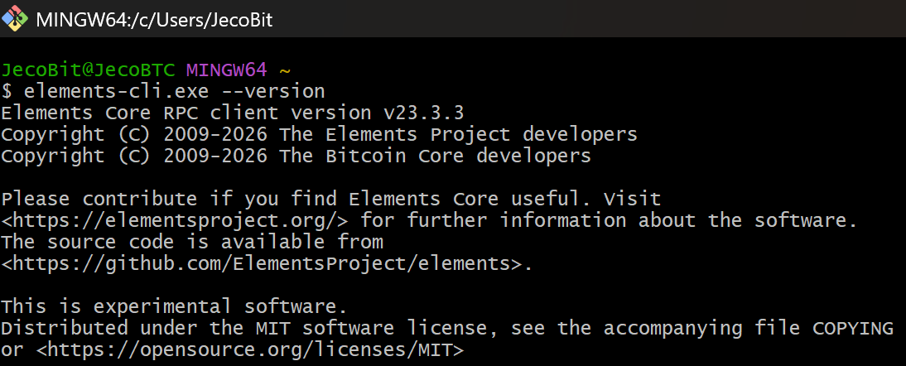
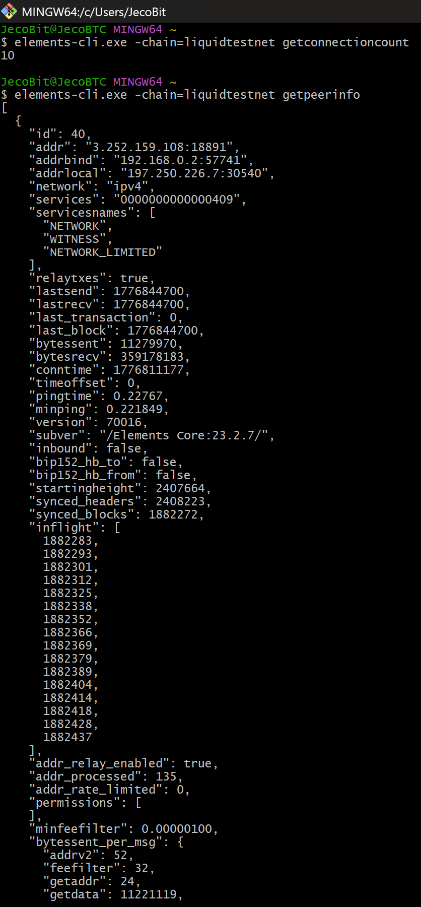
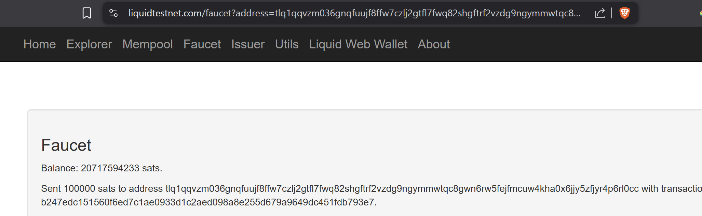
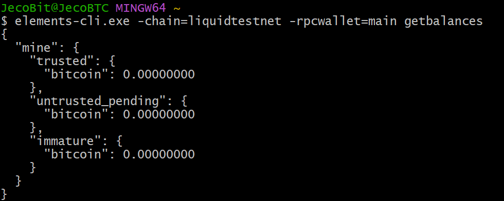
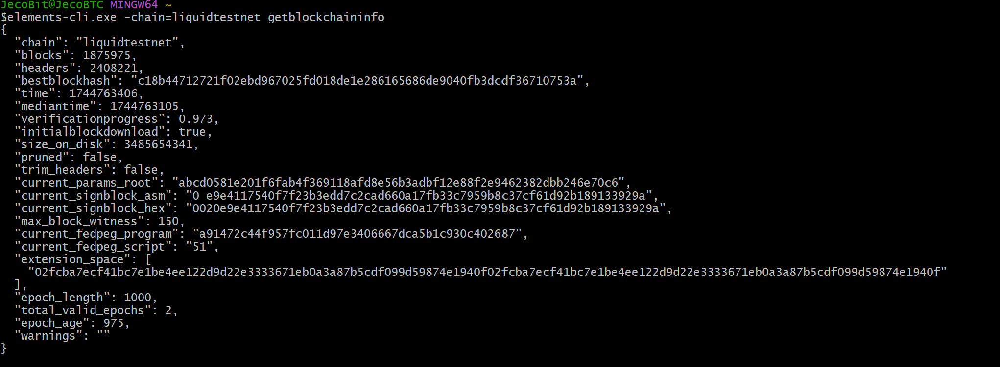

# BSOS Liquid Compliance POC

## Overview

This project is a proof of concept for BSOS’s cross-border settlement use case on Liquid Network. The goal is to demonstrate how a payment corridor can preserve settlement privacy while still supporting Travel Rule-style compliance through an off-chain compliance service.

The prototype is built around two core ideas:

1. **Private settlement layer**  
   Settlement is handled through a Liquid-style transaction model, where transaction details are not intended to be part of the public compliance workflow.

2. **Off-chain compliance layer**  
   Travel Rule data is collected, stored, transmitted, and retrieved through an application-level compliance service. Each settlement event is linked to a unique compliance record so that an auditor can later review the transfer and its associated metadata.

This project was developed for the Plan ₿ Academy Developer Track assignment for BSOS. The assignment requires:
- an evaluation of Liquid as a settlement layer,
- an analysis of VASP and Travel Rule obligations,
- a compliance architecture,
- and a working proof of concept.

---

## Objective

The objective of this POC is to test the viability of a hybrid architecture in which:
- settlement happens through a private blockchain-based rail,
- compliance data remains off-chain,
- and the two layers are linked through a clear audit trail.

The project is intentionally minimal. It focuses on architectural clarity and an end-to-end demonstration rather than a production-grade implementation.

---

## What the POC demonstrates

This prototype demonstrates the following:

- creation of a Travel Rule compliance record,
- assignment of a unique `compliance_record_id`,
- linkage between off-chain compliance data and a settlement reference,
- execution of a settlement event through a backend settlement adapter,
- storage of settlement metadata,
- audit lookup by compliance record ID or txid,
- comparison between declared amount and verified amount.

The interface is intentionally lightweight, and KYC/compliance payload data is simulated for demonstration purposes.

---

## Architecture summary

The corridor modeled in this POC is:

**Brazil User → Partner Exchange → BSOS → Corridor Partner → Recipient**

### Roles

#### Partner Exchange
- collects originator-side data,
- creates the initial compliance record,
- initiates the corridor transfer.

#### BSOS
- receives the compliance payload,
- coordinates settlement,
- links the compliance record to the settlement reference.

#### Corridor Partner
- receives compliance data from upstream,
- handles beneficiary-side payout logic.

#### Regulator / Auditor
- retrieves a transaction through the audit interface,
- reviews the linked compliance record,
- checks whether the declared settlement amount matches the verified amount.

### Design principle

The central design principle is:

> **Privacy is handled on the settlement layer, while compliance is handled off-chain.**

This is the core architectural claim of the project.

---

## Tech stack

- **Backend:** Node.js + Express
- **Database:** SQLite
- **Frontend:** HTML, CSS, JavaScript
- **Settlement adapter:** mock mode or Liquid integration mode
- **Target network:** Liquid testnet

---

## Project structure

```text
backend/
  server.js
  db.js
  liquid.js
  routes/
    createTransfer.js
    listTransfers.js
    sendSettlement.js
    auditLookup.js

frontend/
  index.html
  app.js
  style.css

data/
  compliance.db


## Limitations

This prototype is intentionally limited.

### Development note on Liquid testnet sync

During development, the local Liquid testnet node connected successfully to peers and began syncing. Wallet creation and testnet address generation were successful, and faucet funding was requested to the generated wallet address.

However, the local node remained in initial block download during the submission window, which limited reliable wallet-side settlement verification on the submission machine. For that reason, the final demo uses a simplified settlement adapter while preserving the core compliance and audit architecture.

This limitation does not change the main contribution of the project, which is the architecture showing how:

- Travel Rule data can be collected off-chain.
- Compliance records can be linked to settlement references.
- Auditors can retrieve and verify the relevant record through a controlled workflow.

## Evidence of Liquid integration work

### Elements CLI installed


### Peer connectivity


### Faucet confirmation


### Wallet balance state


### Node sync status
